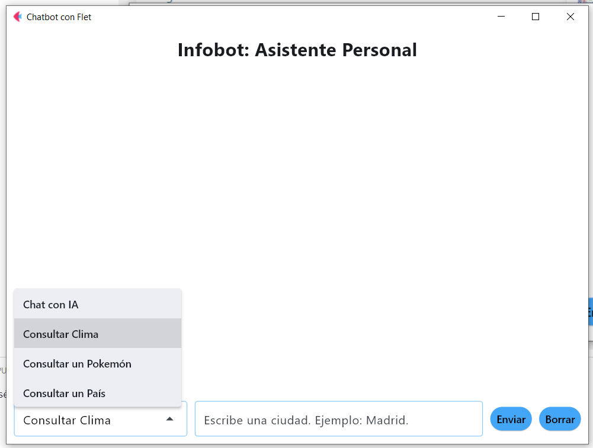
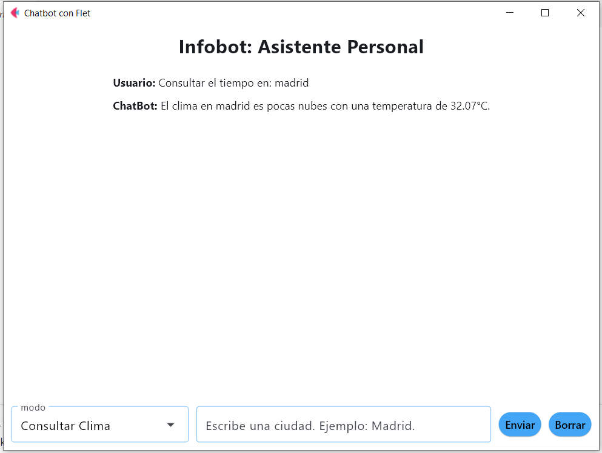
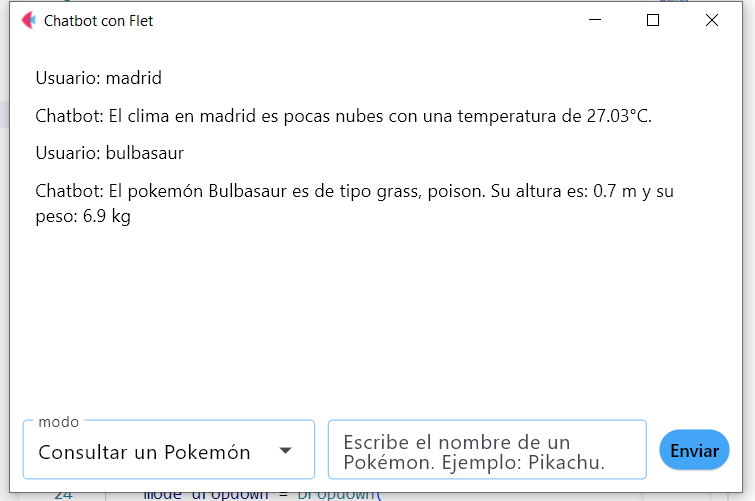
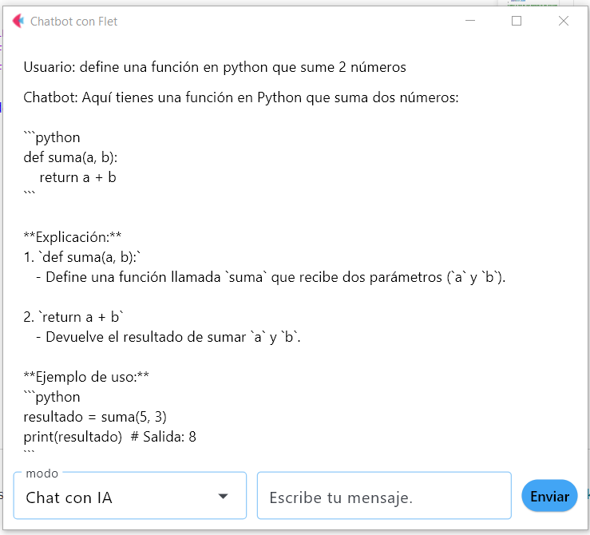
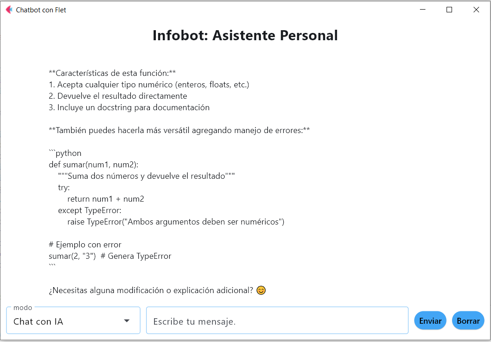
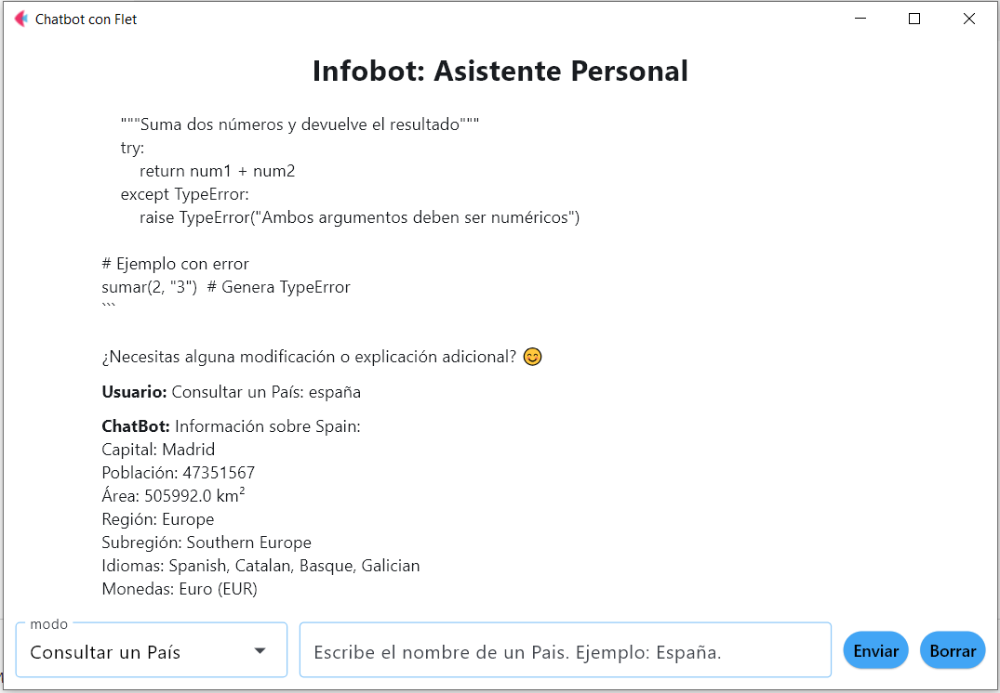

# 🚀 Proyecto: "API4Flet Chat Bot"

<div style="text-align:center">
    </img>
</div>

## 📚 Contenido

- **[1. Descripción](#descripcion)**
- **[2. Objetivo](#objetivo)**
- **[3. Tecnologías Utilizadas](#tecnologias)**
- **[4. Estructura del Proyecto](#estructura)**
- **[5. Ejecución de la Aplicación](#ejecucion)**
- **[6. Funcionamiento de la aplicación](#funcionamiento)**
- **[7. Mejoras](#mejoras)**
- **[8. Licencia](#licencia)**
- **[9. Autor](#autor)**

<h2 id="descripcion">1. 📘 Descripción.</h2>

### 🐍 Acerca de FLET

Antes de comenzar, **¿qué es FLET?**

FLET es un marco de desarrollo de **aplicaciones web y móviles** que permite a los desarrolladores crear aplicaciones **en tiempo real** utilizando Python. Es un marco de código abierto que se basa en el concepto de **"programación reactiva"**, lo que significa que las aplicaciones se **actualizan automáticamente** en función de los cambios en los datos subyacentes.

### ✨ Características alucinantes de FLET

1. Está alimentado por aleteo.
2. Puede dar vida a una aplicación en unos minutos.
3. Tiene una arquitectura sencilla.
4. Además de Python, también se admitirán otros lenguajes como Go, C#, etc.

### 🛠️ Cómo instalar FLET

Para instalar `FLET`, usa este comando:

```bash
pip install flet
```

o

```bash	
pip3 install flet
```

En caso de que no dejará instalarlo es posible que tu gestor de paquetes `pip` esté desactualizado, para actualizar a la última versión.

```bash
pip install --upgrade pip
```

🔼 [subir](#contenido)

<h2 id="objetivo">2. 🎯 Objetivo.</h2>

El objetivo principal del proyecto es crear una aplicación que permita a los usuarios **interactuar con cuatro APIs diferentes** a modo de `ChatBot`. La aplicación está diseñada para ser **intuitiva y fácil** de usar, lo que permite a los usuarios acceder a información valiosa de manera rápida y eficiente. Las 4 apis serán:

1. 🌦️ API de clima OpenWeatherMap.
2. 🐉 API pokemón.
3. 🤖 API OpenRouter.ai.
4. 🌍 API sobre información de países. RestCountries.

🔼 [subir](#contenido)

<h2 id="tecnologias">3. 🧰 Tecnologías utilizadas.</h2>

- **[Python](https://www.python.org/)** -> `Python` es un lenguaje de programación de alto nivel, interpretado y de propósito general. Es el lenguaje utilizado para desarrollar la aplicación.

- **[Flet](https://flet.dev/)** -> `Flet` es un marco de desarrollo de aplicaciones web y móviles que permite a los desarrolladores crear aplicaciones en tiempo real utilizando Python. Lo utilizaremos para construir la interfaz de usuario.

- **[OpenRouter](https://openrouter.ai/)** -> `OpenRouter` ofrece acceso sin interrupciones a una variedad de **modelos de IA**, proporciona una API que te permite acceder a diferentes modelos de IA a través de un **único punto** final. En este caso usaremos el modelo de `DeepSeek::r1` que es gratuito y ofrece unos resultados bastantes buenos. **Es necesario obtener una api_key para usarla.**

- **[OpenAi](https://openai.com/)** -> Librería de python que nos permite interactuar con el modelo de **IA de DeepSeek** a través de OpenRouter.

Se puede instalar con el siguiente comando:

```bash
pip install openai
```

- **[API de clima OpenWeatherMap](https://openweathermap.org/)** -> Proporciona información sobre el clima actual y pronósticos. **Es necesario obtener una api_key para usarla.**
  
- **[Poke-API](https://pokeapi.co/)** -> Proporciona información sobre diferentes pokemons. **No es necesario obtener una api_key para usarla.**

- **[API RestCountries.](https://restcountries.com/)** -> Proporciona información sobre diferentes países, como su población, capital, moneda, etc. **No es necesario obtener una api_key para usarla.** La **activación** de la cuenta suele tardar alrededor de `45 minutos`, tras lo cual te mandarán un mensaje al correo electrónico verificando que la cuenta está activa y lista para usar.

- **[DotEnv](https://pypi.org/project/python-dotenv/)** -> Librería que permite cargar variables de entorno desde un archivo `.env` a la aplicación.

Se puede instalar con el siguiente comando:

```bash
pip install python-dotenv
```

🔼 [subir](#contenido)

<h2 id="estructura">4. 🗂️ Estructura del proyecto.</h2>

El proyecto está estructurado de la siguiente manera:

- **chat_bot.py**: Archivo principal de la aplicación que contiene la lógica de la aplicación.

- **functions.py**: Archivo que contiene las funciones necesarias para interactuar con las diferentes APIs.

- **.env**: Archivo que contiene las variables de entorno necesarias para la aplicación. En este caso, contiene la **api_key de OpenRouter y OpenWeatherMap**.

    - **📌 Importante:**
        Deberás de poner tus propias claves de las APIs en el archivo `.env` para que la aplicación funcione correctamente. Sino la obtienes, podrás probar la aplicación sólo con la API de **Poke-API** y **RestCountries**, ya que no requieren una clave de API para su uso.

- **requirements.txt**: Archivo que contiene las dependencias necesarias para ejecutar la aplicación.

## **📌 Importante:**

Proporciono el archivo `requirements.txt` para que puedas instalar todas las dependencias necesarias de una sola vez. Se proporciona sólo las dependencias necesarias, ya que se ha probado en un entorno virtual y no se han encontrado problemas de compatibilidad. Sí por algún caso no quieres usar el archivo `requirements.txt`, puedes instalar las librerías y dependencias necesarias de forma manual, como se ha ido explicando a lo largo de la documentación.

**⚠️ Puedes instalar todo lo necesario ejecutando el siguiente comando:**

```bash
pip install -r requirements.txt
```

o

```bash
pip3 install -r requirements.txt
```

Dejo también un enlace a la **documentación de python** sobre cómo crear un entorno virtual, por si quieres usarlo, ya que es una buena práctica para evitar **problemas de compatibilidad** entre diferentes proyectos o por sí tuvieras **varias versiones** de python instaladas en tu sistema.

- **🔗 [Documentación Entornos Virtuales](https://docs.python.org/es/3/tutorial/venv.html).**

🔼 [subir](#contenido)

<h2 id="ejecucion">5. ▶️ Ejecución de la aplicación.</h2>

Para ejecutar la aplicación, asegúrate de tener todas las dependencias instaladas y luego ejecuta el siguiente comando en la terminal:

```bash
python chat_bot.py
```

o

```bash
python3 chat_bot.py
```

Esto iniciará la aplicación y abrirá una ventana donde podrás interactuar con la aplicación.

Si usas `Visual Studio Code`, puedes ejecutar la aplicación directamente desde el editor. Para ello, abre el archivo `chat_bot.py` y haz clic en el botón de **"Ejecutar"** (el triángulo) en la parte superior derecha del editor.

🔼 [subir](#contenido)

<h2 id="funcionamiento">6. 🤖 Funcionamiento de la aplicación.</h2>

1. **Interacción del usuario**: El usuario interactúa con la aplicación a través de la interfaz de usuario creada con Flet.
   
2. **Selección de la API**: El usuario selecciona la API con la que desea interactuar (clima, pokemón, OpenAI o información de países).
   
3. **Entrada de datos**: El usuario proporciona la información necesaria para realizar la consulta a la API seleccionada (por ejemplo, el nombre de una ciudad para obtener el clima o el nombre de un país para obtener información sobre él).
   
4. **Validación de datos**: La aplicación valida la información proporcionada por el usuario para asegurarse de que es correcta y está en el formato adecuado.
   
5. **Llamadas a las APIs**: La aplicación realiza la llamada a la API correspondiente con la información proporcionada por el usuario.
   
6. **Procesamiento de la información**: La información de la API se procesa y se presenta al usuario de manera clara y concisa.
   
7. **Actualización de la interfaz**: La interfaz de usuario se actualiza automáticamente para reflejar la información más reciente.
   
8. **Interacción continua**: El usuario puede seguir interactuando con la aplicación, realizando nuevas consultas y obteniendo nueva información.
       
9. **Manejo de errores**: La aplicación maneja errores y excepciones de manera adecuada, proporcionando mensajes claros al usuario en caso de que algo salga mal.

### 🖼️ Ejemplos de uso de la aplicación:



### 📌 Ejemplo de uso de la aplicación con la API de OpenWeatherMap:


### 📌 Ejemplo de uso de la aplicación con la API de Poke-API:


### 📌 Ejemplo de uso de la aplicación con la API de OpenRouter:




### 📌 Ejemplo de uso de la aplicación con la API de RestCountries:


🔼 [subir](#contenido)

<h2 id="mejoras">7. 🔧 Mejoras</h2>

- **Mejorar la interfaz de usuario**: Se pueden agregar más elementos visuales y mejorar la experiencia del usuario.
  
- **Agregar más funcionalidades**: Se pueden agregar más APIs o funcionalidades a la aplicación para hacerla más completa.
  
- **Agregar autenticación**: Se puede agregar un sistema de autenticación para que solo los usuarios autorizados puedan acceder a la aplicación.

🔼 [subir](#contenido)

<h2 id="licencia">8. 📄 Licencia.</h2>

Este proyecto está bajo la **licencia MIT**.

🔼 [subir](#contenido)

<h2 id="autor">9. 👨‍💻 Autor.</h2>

- [José Miguel Escribano Ruiz](https://github.com/JMER15)

🔼 [subir](#contenido)
